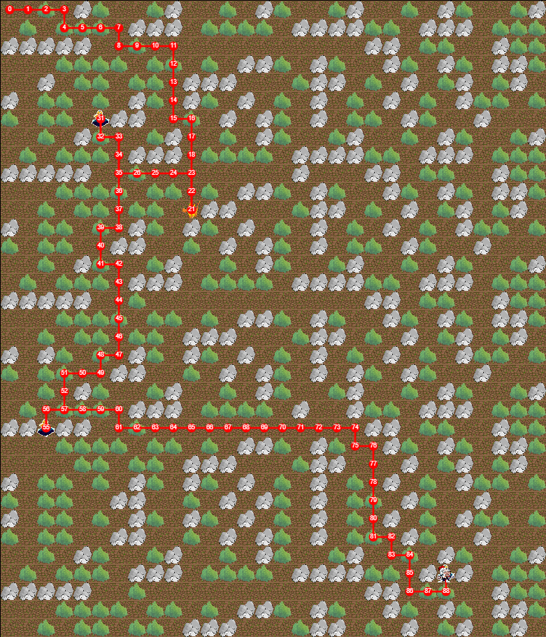

### Program that uses Dijkstra's shortest path finding algorithm.

If you are using the **DevC++** to compile and run the program there is an error which you can fix by adding the code in brackets below:

```
-> (-std=c99 -std=gnu99 -std=c11 -std=gnu11)
-> tools-> compiler options-> general tab-> paste the code in the top textarea-> check the top checkbox, add the following commands when calling the compiler
```

If you want to run the program from **command line** use the commands below:

```
-> gcc -g Heap.c Stage.c Path.c Main.c test.c -o bigH3.exe
-> bigH3.exe
```

***test.txt*** is used as a external file to read a map from it.

1st row must contain 3 numbers (n->height, m->width, t->time or how long until dragon wakes up)


#### Input/Output example

If you are interested in input/output of this program, please see this 
**[input-output](https://github.com/VladimirJevtic95/C-Dijkstra-GridCoordinates/blob/master/test_screenshots/input_output.md)** 
file.


#### Some of the test screen shots





